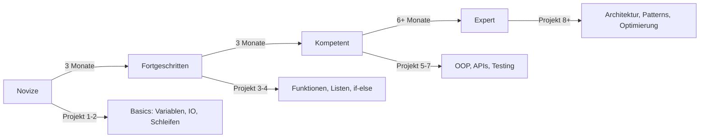

# Kompetenzframework: KI-gestütztes Programmieren-Lernen

## Überblick

Dieses Framework definiert **messbare Kompetenzen**, **Beobachtungsindikatoren** und **Diagnostikmethoden** für projektbasiertes Lernen mit KI-Copilot.

---

## 🎯 Kompetenzraster

### 1. **Modellieren & Strukturieren**

**Beschreibung:** Probleme analysieren, abstrahieren und in informatische Modelle überführen

| Level | Fähigkeiten | Beobachtbare Indikatoren |
|-------|-------------|-------------------------|
| **Novize** | • Erkennt einfache Muster<br>• Beschreibt Probleme in Alltagssprache | • Nutzt konkrete Beispiele statt Abstraktion<br>• Schwierigkeiten bei Zerlegung in Teilprobleme |
| **Fortgeschritten** | • Zerlegt Probleme systematisch<br>• Erstellt Pseudocode/Diagramme<br>• Erkennt Datenstrukturen | • Nutzt Diagramme spontan<br>• Beschreibt Zustände und Übergänge<br>• Identifiziert Ein-/Ausgaben |
| **Kompetent** | • Wendet Entwurfsmuster an<br>• Modelliert OOP-Strukturen<br>• Plant vor Implementierung | • Erstellt UML/ER-Diagramme<br>• Begründet Designentscheidungen<br>• Antizipiert Edge Cases |
| **Expert** | • Evaluiert Architekturalternativen<br>• Optimiert Modelle<br>• Transferiert auf neue Domänen | • Diskutiert Trade-offs<br>• Refactored proaktiv<br>• Nutzt Design Patterns gezielt |

**Messmethoden:**

- **Artefakte:** Pseudocode, Diagramme, Spec-Dokumente
- **Prozess:** Modellierungsschritte im Chat dokumentiert
- **Transfer:** Kann Modell auf ähnliches Problem anwenden

---

### 2. **Implementieren & Coding**

**Beschreibung:** Modelle in syntaktisch korrekten, funktionalen Code umsetzen

| Level | Fähigkeiten | Beobachtbare Indikatoren |
|-------|-------------|-------------------------|
| **Novize** | • Liest & ändert vorhandenen Code<br>• Kennt Basistypen (int, string)<br>• Nutzt einfache Ausgaben | • Führt Code aus und beobachtet<br>• Ändert Variablenwerte experimentell<br>• Fragt: "Wie schreibt man...?" |
| **Fortgeschritten** | • Schreibt Funktionen selbst<br>• Nutzt Listen/Arrays<br>• Implementiert Kontrollstrukturen | • Code läuft mit wenigen Fehlern<br>• Nutzt Schleifen und Bedingungen korrekt<br>• Schreibt kleine Module |
| **Kompetent** | • Entwickelt objektorientiert<br>• Nutzt APIs/Bibliotheken<br>• Schreibt Tests | • Code ist strukturiert und lesbar<br>• Dokumentiert Funktionen<br>• Unit Tests vorhanden |
| **Expert** | • Optimiert Performance<br>• Implementiert komplexe Algorithmen<br>• Nutzt fortgeschrittene Features | • Idiomatischer Code<br>• Design Patterns implementiert<br>• Error Handling robust |

**Messmethoden:**

- **Code-Qualität:** Linter-Score, Code-Review-Feedback
- **Übernahmequote:** % selbst geschriebener Code (Git-Commits)
- **Funktionalität:** Tests bestanden, Anforderungen erfüllt

---

### 3. **Reflektieren & Bewerten**

**Beschreibung:** Eigenes Vorgehen kritisch hinterfragen, Alternativen erkennen, begründen

| Level | Fähigkeiten | Beobachtbare Indikatoren |
|-------|-------------|-------------------------|
| **Novize** | • Benennt Schwierigkeiten<br>• Erklärt was der Code tut (oberflächlich) | • "Das funktioniert nicht"<br>• Nennt Symptome, nicht Ursachen |
| **Fortgeschritten** | • Erklärt eigene Lösungswege<br>• Erkennt Fehlerursachen mit Hilfe<br>• Vergleicht Ansätze | • "Ich habe X probiert, weil..."<br>• Fragt nach Alternativen<br>• Versteht Fehlermeldungen teilweise |
| **Kompetent** | • Begründet Designentscheidungen<br>• Debuggt systematisch<br>• Reflektiert Lernprozess | • Nutzt Debugger gezielt<br>• Dokumentiert Lessons Learned<br>• Vergleicht Trade-offs |
| **Expert** | • Evaluiert Codebasis kritisch<br>• Antizipiert Wartbarkeit<br>• Reflektiert über KI-Nutzung | • Refactored proaktiv<br>• Diskutiert technische Schulden<br>• Hinterfragt KI-Vorschläge kritisch |

**Messmethoden:**

- **Reflexionsjournal:** Qualität der Einträge (Tiefe, Kritikfähigkeit)
- **Debugging-Protokolle:** Systematik der Fehlersuche
- **Meta-Aussagen:** "Ich dachte...", "Beim nächsten Mal würde ich..."

---

### 4. **Kommunizieren & Kooperieren**

**Beschreibung:** Ideen präzise ausdrücken (mit Menschen & KI), im Team arbeiten

| Level | Fähigkeiten | Beobachtbare Indikatoren |
|-------|-------------|-------------------------|
| **Novize** | • Stellt einfache Fragen<br>• Beschreibt Ziele vage | • "Wie macht man ein Spiel?"<br>• Unspezifische Prompts |
| **Fortgeschritten** | • Formuliert konkrete Anforderungen<br>• Erklärt Code anderen<br>• Bittet um spezifische Hilfe | • "Wie implementiere ich X mit Y?"<br>• Kann eigenen Code erläutern<br>• Präzisiert Fragen nach Rückfragen |
| **Kompetent** | • Dokumentiert klar<br>• Präsentiert Ergebnisse strukturiert<br>• Nutzt Fachsprache korrekt | • README ist verständlich<br>• Nutzt Issue-Tracker/Kommentare<br>• Prompts sind kontextreich |
| **Expert** | • Erklärt komplexe Konzepte einfach<br>• Gibt konstruktives Feedback<br>• Moderiert technische Diskussionen | • Teaching-Ansatz in Präsentation<br>• Code-Reviews mit Begründungen<br>• Hilft anderen gezielt |

**Messmethoden:**

- **Prompt-Qualität:** Spezifität, Kontext, Fachbegriffe
- **Dokumentation:** README, Kommentare, Dev-Log
- **Präsentation:** Struktur, Verständlichkeit, Visualisierung

---

### 5. **KI-Kooperation & Medienkompetenz** (NEU)

**Beschreibung:** KI als Werkzeug gezielt nutzen, Grenzen erkennen, kritisch validieren

| Level | Fähigkeiten | Beobachtbare Indikatoren |
|-------|-------------|-------------------------|
| **Novize** | • Nutzt KI für einfache Fragen<br>• Akzeptiert Vorschläge ungefiltert | • Copy-Paste ohne Verständnis<br>• Fragt: "Kannst du das machen?" |
| **Fortgeschritten** | • Iteriert Prompts bei Unzufriedenheit<br>• Testet KI-Code<br>• Erkennt Fehler teilweise | • Verbessert Prompts nach Feedback<br>• Führt Code aus vor Übernahme<br>• Fragt: "Warum funktioniert das?" |
| **Kompetent** | • Steuert KI gezielt für Teilaufgaben<br>• Validiert Vorschläge systematisch<br>• Nutzt KI als Reviewer | • Delegiert Boilerplate an KI<br>• Implementiert Kernlogik selbst<br>• Bittet um Code-Review |
| **Expert** | • Nutzt KI als Sparring-Partner<br>• Diskutiert Architekturalternativen<br>• Reflektiert KI-Limitationen | • Fragt nach Trade-offs<br>• Erkennt Halluzinationen<br>• Dokumentiert KI-Beiträge |

**Messmethoden:**

- **Chat-Analyse:** Prompt-Evolution, Iterations-Zyklen
- **Validierungsverhalten:** Tests, Code-Prüfung
- **Reflexion:** Aussagen über KI-Grenzen, ethische Aspekte

---

## 📊 Lernfortschrittsdiagnostik

### Automatisierte Indikatoren

#### 1. **Prompt-Evolution-Analyse**

**Tracking:** Qualität der Prompts über Zeit

```yaml
Messkriterien:
  - Spezifität: Vage → Konkret
  - Kontext: Fehlend → Umfassend
  - Fachsprache: Umgangssprache → Terminologie
  - Intention: "Mach das" → "Hilf mir bei X zu verstehen"

Beispiel-Progression:
  Woche 1: "Wie macht man ein Spiel?"
  Woche 4: "Wie implementiere ich eine Game Loop in Python?"
  Woche 8: "Was sind die Trade-offs zwischen Frame-based und Time-based Updates?"
```

**Tool:** Sentiment + Keyword-Analyse der Chat-Historie

---

#### 2. **Code-Übernahmequote (Authorship-Tracking)**

**Tracking:** Anteil selbst geschriebener Code

```yaml
Metriken:
  - Lines of Code (self-written): absolut & %
  - Commits: Autor vs. KI-generiert
  - Funktionen: Eigenentwicklung vs. adaptiert

Interpretation:
  - 0-30% → KI-dominant, Lernender hauptsächlich Consumer
  - 30-70% → Ko-Kreation, gesunde Balance
  - 70-100% → Selbstständig, KI nur als Consultant

Wichtig: Nicht nur Quantität, auch Komplexität der Aufgaben!
```

**Tool:** Git-Blame-Analyse + Commit-Messages

---

#### 3. **Debugging-Autonomie-Score**

**Tracking:** Selbstständigkeit bei Fehlersuche

```yaml
Level 0: Gibt bei Fehler auf oder fragt sofort KI
Level 1: Versucht eine Änderung, fragt dann KI
Level 2: Systematisch testen (Print-Debugging), KI bei Stagnation
Level 3: Nutzt Debugger, formuliert Hypothesen, KI als Sparring
Level 4: Debuggt vollständig selbst, KI nur für Best Practices

Messbar durch:
  - Zeit zwischen Fehler und KI-Anfrage
  - Anzahl eigener Lösungsversuche
  - Qualität der Fehlerbeschreibung
```

**Tool:** Fehler-Logs + Chat-Timestamps

---

#### 4. **Konzept-Mastery-Tracker**

**Tracking:** Beherrschung informatischer Konzepte

```yaml
Konzepte (Beispiele):
  - Variablen & Datentypen
  - Kontrollstrukturen (if/else, loops)
  - Funktionen & Parameter
  - Datenstrukturen (Listen, Dictionaries)
  - OOP (Klassen, Objekte, Vererbung)

Mastery-Stufen pro Konzept:
  1. Exposure: Gehört/gesehen
  2. Recognition: Erkennt in Code
  3. Recall: Kann beschreiben
  4. Application: Nutzt mit Anleitung
  5. Analysis: Nutzt selbstständig
  6. Synthesis: Kombiniert mit anderen Konzepten

Tracking:
  - KI taggt Konzepte in Interaktionen
  - Lernender bestätigt/korrigiert Verständnis
  - Progression über Projekte sichtbar
```

**Tool:** Concept-Tagging + Self-Assessment

---

#### 5. **Metakognitive Reifung**

**Tracking:** Selbstwahrnehmung & Lernstrategien

```yaml
Indikatoren:
  - "Ich weiß nicht, wie ich anfangen soll" → niedrig
  - "Ich probiere erst X, dann Y" → mittel
  - "Ich plane zuerst, dann implementiere ich" → hoch
  - "Ich reflektiere über meine Lernstrategie" → sehr hoch

Messbar durch:
  - Aussagen über eigenes Vorgehen
  - Nutzung von Planungstools (Spec, Notizen)
  - Reflexionstiefe in Journaling
  - Anpassung von Lernstrategien
```

**Tool:** NLP-Analyse von Reflexionstexten

---

### Manuelle Assessment-Methoden

#### A. **Projekt-Portfolio-Review**

**Regelmäßig:** Ende jedes Projekts

**Checkliste:**

```markdown
## Projektbewertung

### Anforderungsanalyse
- [ ] Klare Zielbeschreibung
- [ ] Funktionale Anforderungen spezifiziert
- [ ] Testfälle definiert

### Konzeption
- [ ] Lösungsplan vorhanden (Pseudocode/Diagramm)
- [ ] Datenmodell erkennbar
- [ ] Designentscheidungen begründet

### Implementation
- [ ] Code läuft und erfüllt Anforderungen
- [ ] Struktur nachvollziehbar
- [ ] Kommentare sinnvoll

### Reflexion
- [ ] Lessons Learned dokumentiert
- [ ] Schwierigkeiten benannt und gelöst
- [ ] Nächste Schritte identifiziert

### KI-Kooperation
- [ ] KI-Beiträge dokumentiert
- [ ] Validierung erkennbar
- [ ] Kritische Reflexion über KI-Nutzung
```

---

#### B. **Concept-Mapping-Interviews**

**Frequenz:** Halbjährlich

**Methode:**

- Lernender erstellt Concept Map zu Thema (z.B. "Programmierung")
- Zeigt Verbindungen zwischen Konzepten
- Erklärt mündlich die Beziehungen

**Auswertung:**

- Anzahl der Konzepte
- Tiefe der Hierarchie
- Korrektheit der Beziehungen
- Verwendung von Fachbegriffen

---

#### C. **Peer-Review-Sessions**

**Methode:**

- Lernende reviewen Code anderer
- Geben konstruktives Feedback
- Diskutieren Alternativen

**Bewertung:**

- Qualität des Feedbacks
- Konstruktivität
- Fachliche Korrektheit
- Kommunikationsstil

---

## 🎯 Kompetenz-Progressions-Pfade

### Typischer Lernpfad (6-12 Monate)



**Meilensteine:**

| Nach | Erwartete Kompetenzen |
|------|----------------------|
| **3 Monate** | • Liest & ändert Code<br>• Schreibt einfache Programme mit Anleitung<br>• Nutzt Variablen, Schleifen, Bedingungen |
| **6 Monate** | • Schreibt Funktionen selbstständig<br>• Implementiert Kontrollstrukturen<br>• Debuggt mit Hinweisen |
| **12 Monate** | • Entwickelt vollständige kleine Projekte<br>• Nutzt OOP-Grundlagen<br>• Dokumentiert und testet<br>• Debuggt systematisch |
| **18+ Monate** | • Plant und implementiert komplexe Systeme<br>• Evaluiert Architekturalternativen<br>• Mentort andere<br>• Nutzt KI als Sparring-Partner |

---

## 📈 Dashboard-Visualisierung (Konzept)

### Lehrer-Dashboard

**Übersicht pro Schüler:**

```
┌─────────────────────────────────────────┐
│ Schüler: Max Mustermann                │
│ Aktuelles Projekt: Wetter-App          │
│ Level: Fortgeschritten (Stufe 2.5)     │
├─────────────────────────────────────────┤
│ Kompetenzen:                            │
│ ████████░░ Modellieren        80%       │
│ ██████░░░░ Implementieren     60%       │
│ ███████░░░ Reflektieren       70%       │
│ ████████░░ Kommunizieren      80%       │
│ █████░░░░░ KI-Kooperation     50%       │
├─────────────────────────────────────────┤
│ Fortschritt:                            │
│ • Prompt-Qualität: ↑ +15%               │
│ • Code-Übernahme: 45% (↑ von 30%)      │
│ • Debugging-Autonomie: Level 2          │
├─────────────────────────────────────────┤
│ Empfehlungen:                           │
│ ⚠️  Mehr Reflexion fördern               │
│ ✅ Stärke in Kommunikation nutzen       │
│ 📚 KI-Kritikfähigkeit trainieren        │
└─────────────────────────────────────────┘
```

---

## 🔍 Self-Assessment für Lernende

### Monatlicher Check-in

**Fragen:**

1. **Modellieren:**
   - Kann ich Probleme in Teilschritte zerlegen? ⭐⭐⭐☆☆
   - Erstelle ich Pläne vor dem Coden? ⭐⭐☆☆☆

2. **Implementieren:**
   - Kann ich einfache Programme allein schreiben? ⭐⭐⭐⭐☆
   - Verstehe ich meinen eigenen Code? ⭐⭐⭐⭐☆

3. **Debugging:**
   - Finde ich Fehler selbst? ⭐⭐☆☆☆
   - Nutze ich systematische Strategien? ⭐☆☆☆☆

4. **KI-Nutzung:**
   - Stelle ich gute Fragen an die KI? ⭐⭐⭐☆☆
   - Prüfe ich KI-Vorschläge kritisch? ⭐⭐☆☆☆

**Interpretation:**
- ⭐☆☆☆☆ → Fokusbereich für nächstes Projekt
- ⭐⭐⭐☆☆ → Solide, weiter üben
- ⭐⭐⭐⭐⭐ → Stärke, anderen helfen!

---

## 🎓 Bewertungs-Rubrik (für Lehrer)

### Projekt-Endabnahme

| Kriterium | Gewicht | Novize (1) | Fortgeschritten (2) | Kompetent (3) | Expert (4) |
|-----------|---------|------------|---------------------|---------------|------------|
| **Funktionalität** | 20% | Teilweise lauffähig | Läuft mit Bugs | Erfüllt Anforderungen | Übertrifft Erwartungen |
| **Code-Qualität** | 20% | Unstrukturiert | Basis-Struktur | Gut lesbar | Idiomatisch, elegant |
| **Dokumentation** | 15% | Kaum vorhanden | README vorhanden | Umfassend | Professional |
| **Lernprozess** | 20% | Wenig dokumentiert | Journal geführt | Reflektiert | Tiefe Analyse |
| **Selbstständigkeit** | 15% | Stark KI-abhängig | Ko-Kreation | Überwiegend selbst | Völlig autonom |
| **Präsentation** | 10% | Unklar | Verständlich | Strukturiert | Inspirierend |

**Punkteberechnung:**
- 1.0-1.5: Grundlagen vorhanden, mehr Übung nötig
- 1.6-2.5: Fortschritt erkennbar, auf gutem Weg
- 2.6-3.5: Solide Kompetenzen, kann selbstständig arbeiten
- 3.6-4.0: Exzellent, kann anderen helfen

---

## 📚 Integration ins Framework

### Verwendung in anderen Dokumenten

- **`phase-prompts.md`:** Nutzt Kompetenzlevel für adaptive Prompts
- **`conversation-patterns.md`:** Assessment-Patterns basieren auf Indikatoren
- **`pedagogical-model.md`:** Verlinkt zu Diagnostik-Methoden
- **`project-spec.yaml`:** Enthält Kompetenz-Ziele pro Projekt

### Datenfluss

```
Lernende ↔️ KI-Copilot
     ↓           ↓
  Code         Chat-Logs
     ↓           ↓
Git-Analyse  NLP-Analyse
     ↓           ↓
  Kompetenz-Dashboard
     ↓
  Lehrer + Lernende
```

---

## 🔮 Zukunftserweiterungen

1. **Adaptive Scaffolding-Engine:** KI passt Hilfe automatisch an
2. **Gamification:** Badges für Meilensteine
3. **Peer-Matching:** Verbindet Lernende mit ähnlichem Level
4. **Predictive Analytics:** Früherkennung von Lernschwierigkeiten
5. **Multi-Language-Support:** Tracking über verschiedene Programmiersprachen

---

**Version:** 1.0  
**Datum:** 2025-11-03  
**Status:** Aktiv - Teil des `.copilot/` Frameworks
