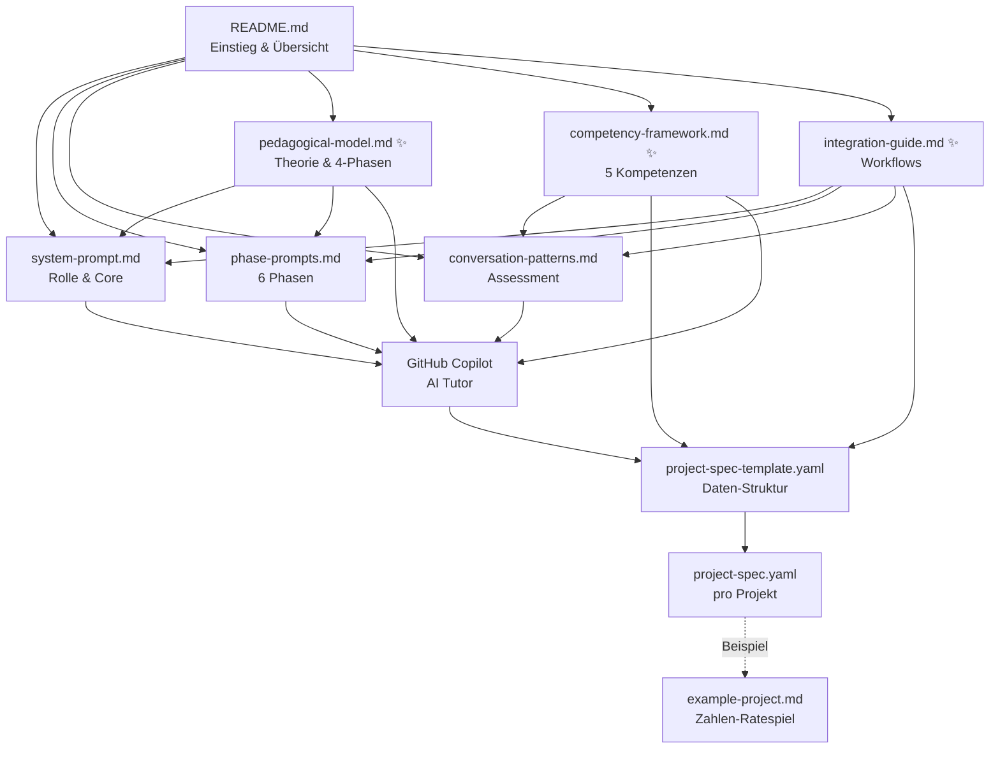

# Prompt Framework - Datei-Übersicht

Vollständiges Verzeichnis aller Prompt-Framework-Dateien mit Zweck und Verwendung.

---

## 📁 Dateistruktur

```
.copilot/
├── README.md                     # Hauptdokumentation & Integration-Guide
├── system-prompt.md              # Master System Prompt für Copilot
├── phase-prompts.md              # Detaillierte Prompts für alle 6 Phasen
├── conversation-patterns.md      # Konversationsmuster & Assessment
├── project-spec-template.yaml    # YAML-Template für Projekspezifikationen
├── example-project.md            # Vollständiges Beispielprojekt
├── file-overview.md              # Diese Datei
│
├── pedagogical-model.md          # ✨ NEU: Theoretisches Fundament (4-Phasen, Rollen)
├── competency-framework.md       # ✨ NEU: 5 Kompetenzen, Diagnostik, Rubrik
└── integration-guide.md          # ✨ NEU: Framework-Integration & Workflows
```

> **✨ NEU (November 2025):** Erweitert um wissenschaftlich fundierte didaktische Frameworks basierend auf 
> Polya, Vygotsky, Collins, Hubwieser, Wing und GI-Bildungsstandards.

---

## 📄 Datei-Details

### 1. README.md
**Zweck:** Haupteinstieg und Integrations-Anleitung

**Inhalt:**
- Übersicht über das gesamte Framework
- Erklärung der 6 Lernphasen
- Adaptive Scaffolding-Strategie
- Assessment Framework Übersicht
- Engagement-Monitoring
- Conversation Patterns Zusammenfassung
- Integration in GitHub Copilot
- Beispiel-Interaktionen
- Verbindung zu Learning Paths
- Testing & Evaluation
- Anpassungs-Guidelines

**Für wen:**
- Entwickler, die das Framework integrieren
- Lehrer, die das System verstehen wollen
- Neue Nutzer als erste Anlaufstelle

**Wann verwenden:**
- Beim Setup des Systems
- Als Referenz für Gesamtübersicht
- Bei Integration in neue Projekte

---

### 2. system-prompt.md
**Zweck:** Master System Prompt - definiert Rolle und Verhalten des Copilots

**Inhalt:**
- Kernprinzipien (4 Hauptprinzipien)
  1. Adaptive Schwierigkeitsanpassung
  2. Projektbasiertes Lernen
  3. Socratic Methode & Guided Discovery
  4. Motivation & Ermutigung
- Interaktionsmuster (Projekt-Start, während Entwicklung)
- Scaffolding-Strategie (3 Level)
- Code-Vorschläge Guidelines
- Spec-Driven Development Integration
- Kommunikationsstil
- Fortschrittsverfolgung
- Best Practices (DO/DON'T)
- Technische Integration
- Beispiel-Interaktion

**Für wen:**
- GitHub Copilot (als Instruktion)
- Entwickler (um Copilot-Verhalten zu verstehen)

**Wann verwenden:**
- Als Copilot Instructions in VS Code
- Als Basis für alle Interaktionen
- Kontinuierlich aktiv während Sessions

**Integration:**
```
.github/copilot-instructions.md verweist auf diese Datei
oder:
VS Code Settings → Copilot Instructions → Inhalt dieser Datei
```

---

### 3. phase-prompts.md
**Zweck:** Detaillierte, verwendbare Prompts für alle 6 Lernphasen

**Inhalt:**

#### Phase 1: Projektinitiierung
- Eröffnungs-Prompts
- Vertiefungs-Fragen (3 Level-Varianten)
- Lernziel-Identifikation
- Motivations-Verstärkung

#### Phase 2: Exploration & Anforderungsanalyse
- Anforderungs-Dialog
- Iterative Verfeinerung
- Spec-Generierung (automatisch)
- Bestätigungs-Prompt

#### Phase 3: Konzept & Design
- Design-Einführung (3 Level-Varianten)
- Modellierungs-Hilfen
- Design-Review-Fragen

#### Phase 4: Implementation
- Implementierungs-Start (3 Level-Varianten)
- Scaffolding während Implementation
- Progressiver Hinweis-Mechanismus (4 Stufen)
- Code-Review & Feedback

#### Phase 5: Reflexion & Debugging
- Debugging-Strategien (3 Level-Varianten)
- Reflexions-Prompts
- Code-Review Session
- Metacognitive Questions

#### Phase 6: Dokumentation & Präsentation
- Dokumentations-Anleitung
- Dev-Log erstellen (3 Level-Varianten)
- Präsentations-Vorbereitung
- Code-Kommentierung

#### Zusätzlich:
- Zusammenfassung & Abschluss
- Meta-Prompts (für Copilot-Selbstreflexion)

**Für wen:**
- Copilot (als Prompt-Vorlagen)
- Entwickler (zum Verstehen der Phasen)
- Lehrer (als didaktische Referenz)

**Wann verwenden:**
- Copilot wählt automatisch passende Phase
- Bei Projekt-Start: Phase 1
- Bei Implementation: Phase 4
- Bei Fehler: Phase 5
- Etc.

**Format:**
Jeder Prompt ist kopierbar und direkt verwendbar, mit Platzhaltern:
```
[PROJEKT-TYP], [Lernziel 1], [PROJEKT-NAME], etc.
```

---

### 4. conversation-patterns.md
**Zweck:** Framework für Konversation, Assessment und adaptive Anpassung

**Inhalt:**

#### Teil 1: Conversation Patterns
- **Frage-Typen:**
  - Open-Ended Questions
  - Guided Discovery Questions
  - Socratic Questions
  - Checkpoint Questions
  
- **Feedback-Patterns:**
  - Positive Reinforcement
  - Constructive Feedback
  - Scaffolded Hints (4 Stufen)

- **Conversation Flows:**
  - Neue Konzept-Einführung
  - Debugging Session
  - Code Review

#### Teil 2: Assessment Framework
- **Wissensstand-Assessment:**
  - Automatische Indikator-Erkennung
  - Assessment-Algorithmus (Python Pseudo-Code)

- **Lernfortschritt-Tracking:**
  - Konzept-Mastery Matrix (6 Stufen)
  - Progress-Metriken (quantitativ & qualitativ)

- **Adaptive Scaffolding:**
  - Scaffolding-Levels (high/medium/low)
  - Fading-Strategy
  - Zone of Proximal Development (ZPD) Mapping

- **Engagement & Motivation Tracking:**
  - Engagement-Indikatoren
  - Motivation-Strategien (intrinsic/extrinsic)
  - Amotivation-Prevention

#### Teil 3: Implementierungs-Guidelines
- Copilot Decision Tree
- Adaptive Behavior Algorithm (Python Pseudo-Code)

**Für wen:**
- Entwickler (Implementation-Details)
- Copilot (Decision-Making Logic)
- Forscher (Didaktische Theorie)

**Wann verwenden:**
- Bei Entwicklung von Copilot-Logik
- Für Assessment-System-Implementation
- Als Referenz für Conversation-Entscheidungen

**Besonderheit:**
Enthält ausführbare Logik (Pseudo-Code) für automatisierte Entscheidungen.

---

### 5. project-spec-template.yaml
**Zweck:** Strukturiertes Template für Projekt-Spezifikationen

**Inhalt:**

#### Hauptsektionen:
1. **Projektinformationen**
   - Name, Typ, Beschreibung
   - Technologie-Stack
   - Repository-Info
   - Dateistruktur

2. **Ziele & Erfolg**
   - Hauptziel, Teilziele
   - Success Criteria
   - MVP-Definition

3. **Anforderungen**
   - Funktionale Requirements
   - Nicht-funktionale Requirements
   - Interaktionen (Inputs/Outputs)

4. **Lernziele**
   - Pro Konzept: ID, Titel, Beschreibung
   - Level, Kategorie, Status
   - Verwendung im Code
   - Ressourcen & Checkpoints

5. **Meilensteine**
   - Pro Meilenstein: Titel, Tasks
   - Status, Deliverables
   - Learning Focus

6. **Student-Profil**
   - Level, bekannte Konzepte
   - Lerngeschwindigkeit
   - Präferenzen
   - Fortschritt & Statistiken
   - Engagement-Tracking

7. **Reflexion & Learnings**
   - Dev-Logs
   - Gelernte Konzepte
   - Häufige Fehler

8. **Assessment & Evaluation**
   - Automatische Checks
   - Selbst-Assessment
   - Copilot-Assessment

9. **Nächste Schritte**
   - Immediate Actions
   - Future Projects
   - Recommended Resources

10. **Metadaten & Tracking**
    - Versions-Info
    - Changelog
    - Tags, Status

**Für wen:**
- Copilot (erstellt automatisch project-spec.yaml)
- Schüler (sieht Fortschritt und Ziele)
- Lehrer (monitort Lernfortschritt)

**Wann verwenden:**
- Bei Projekt-Start: Automatische Generierung
- Während Projekt: Kontinuierliche Updates
- Nach Abschluss: Als Lern-Dokumentation

**Format:**
Standard YAML mit ausführlichen Kommentaren für Verständlichkeit.

**Output:**
Jedes Projekt bekommt eigene `.copilot/project-spec.yaml` Datei.

---

### 6. example-project.md
**Zweck:** Vollständiges Durchlauf-Beispiel eines Lernprojekts

**Inhalt:**

#### Projekt: Zahlen-Ratespiel
- **Vollständige project-spec.yaml** (ausgefüllt)
- **Finaler Code** (kommentiert)
- **Lernreise-Dokumentation** durch alle 6 Phasen:
  1. Projektinitiierung (Dialog)
  2. Anforderungen klären (Dialog)
  3. Design & Modellierung (Dialog)
  4. Implementation (6 Schritte mit Dialogen)
  5. Reflexion (Dialog)
  6. Dokumentation (Code-Kommentare)

#### Zusätzlich:
- **Lessons Learned** (Was gut funktioniert hat)
- **Adaptionen während Projekt** (Engagement, Verständnis-Checks)
- **Success-Tracking**
- **Verwendung als Template** (Variationen für verschiedene Level)

**Für wen:**
- Neue Nutzer (zeigt kompletten Ablauf)
- Entwickler (Template für Tests)
- Lehrer (Beispiel für didaktischen Einsatz)

**Wann verwenden:**
- Als Inspiration für neue Projekte
- Zum Testen des Frameworks
- Als Demonstration des vollständigen Workflows

**Besonderheit:**
Enthält **echte Dialoge** zwischen Copilot und fiktivem Schüler "Max", 
zeigt adaptive Anpassungen in Echtzeit.

---

## 🔄 Zusammenspiel der Dateien (Aktualisiert)



**Legende:**
- **Basis-Framework** (schwarz): Ursprüngliche 7 Dateien
- **Neue Frameworks** ✨ (hervorgehoben): 3 neue didaktische Dateien
- Durchgezogene Pfeile: Direkte Verwendung
- Gestrichelte Pfeile: Beispiel-Beziehung

---

## 🎯 Verwendungsszenarien

### Szenario 1: Neuer Schüler startet erstes Projekt

**Ablauf:**
1. Copilot liest `system-prompt.md` (Rolle verstehen)
2. Copilot nutzt `phase-prompts.md` → **Phase 1** (Projektinitiierung)
3. Dialog mit Schüler (offene Fragen)
4. Copilot nutzt `conversation-patterns.md` → Assessment (Level erkennen)
5. Copilot erstellt `project-spec.yaml` basierend auf `project-spec-template.yaml`
6. Weiter durch Phase 2-6 mit passenden Prompts
7. Kontinuierliches Update von `project-spec.yaml`

**Verwendete Dateien:**
- `system-prompt.md` ✅ (Verhalten)
- `phase-prompts.md` ✅ (Dialoge)
- `conversation-patterns.md` ✅ (Assessment)
- `project-spec-template.yaml` ✅ (Struktur)

---

### Szenario 2: Schüler hat Fehler im Code (Debugging)

**Ablauf:**
1. Copilot erkennt Fehler-Situation
2. Copilot nutzt `conversation-patterns.md` → Decision Tree → "Error-Handling"
3. Copilot nutzt `phase-prompts.md` → **Phase 5** (Debugging)
4. Assessment: Welcher Error-Type? (Syntax/Logic/Conceptual)
5. Passende Debugging-Strategie wählen (Level-abhängig)
6. Guided Debugging Session
7. Update `project-spec.yaml` → common_mistakes Sektion

**Verwendete Dateien:**
- `conversation-patterns.md` ✅ (Decision Tree, Error-Handling)
- `phase-prompts.md` ✅ (Phase 5 Debugging)
- `project-spec.yaml` ✅ (Tracking)

---

### Szenario 3: Entwickler integriert Framework in neues System

**Ablauf:**
1. Liest `README.md` (Übersicht)
2. Versteht `system-prompt.md` (Copilot-Verhalten)
3. Implementiert Logic aus `conversation-patterns.md` (Decision Tree, Assessment)
4. Konfiguriert Copilot mit Instructions
5. Testet mit `example-project.md` (Beispiel durchspielen)
6. Passt Prompts an eigene Bedürfnisse an

**Verwendete Dateien:**
- `README.md` ✅ (Integration-Guide)
- `system-prompt.md` ✅ (Core Behavior)
- `conversation-patterns.md` ✅ (Implementation)
- `example-project.md` ✅ (Testing)

---

## 📊 Datei-Größen & Komplexität

| Datei | Zeilen | Komplexität | Verwendung |
|-------|--------|-------------|------------|
| `README.md` | ~450 | Mittel | Dokumentation |
| `system-prompt.md` | ~250 | Niedrig | Copilot Instructions |
| `phase-prompts.md` | ~1200 | Hoch | Prompt-Bibliothek |
| `conversation-patterns.md` | ~900 | Sehr Hoch | Logic & Assessment |
| `project-spec-template.yaml` | ~450 | Mittel | Data Structure |
| `example-project.md` | ~750 | Niedrig | Demonstration |
| **TOTAL** | **~4000** | - | Komplettes Framework |

---

## 🔧 Anpassung & Erweiterung

### Neue Prompts hinzufügen

**Datei:** `phase-prompts.md`

**Vorgehen:**
1. Identifiziere Phase und Level
2. Füge neuen Prompt im entsprechenden Abschnitt ein
3. Folge dem Format der existierenden Prompts
4. Teste mit Beispiel-Projekt

### Neues Konzept zum Assessment hinzufügen

**Datei:** `conversation-patterns.md` → Teil 2 → Concept-Mastery Matrix

**Vorgehen:**
1. Definiere 6 Mastery-Stages für Konzept
2. Lege Assessment-Methoden fest
3. Definiere Mastery-Criteria
4. Füge zu `project-spec-template.yaml` → learning_objectives hinzu

### Neue Programmiersprache unterstützen

**Dateien:** `phase-prompts.md` + `project-spec-template.yaml`

**Vorgehen:**
1. Passe Code-Beispiele in `phase-prompts.md` an
2. Füge sprachspezifische Patterns hinzu
3. Erweitere `technology` Sektion in YAML-Template
4. Erstelle sprachspezifisches Beispiel-Projekt

---

## 📚 Lern-Ressourcen-Integration

Das Framework ist designed, um mit den **Learning Paths** zu arbeiten:

```
Verbindung:
learning-paths/*.md  →  Konzept-Details & Übungen
            ↕
.copilot/phase-prompts.md  →  Verweise auf Learning Paths
            ↕
project-spec.yaml  →  learning_objectives.resources
```

**Beispiel:**
```yaml
learning_objectives:
  - concept: "oop"
    resources:
      - type: "learning-path"
        path: "/learning-paths/object-oriented-software-construction.md"
        section: "Module 2: Classes & Objects"
```

Copilot kann dann sagen:
```
"Super! Du verstehst jetzt Klassen! 🎉
Wenn du tiefer in OOP einsteigen willst, schau dir 
'Object-Oriented Software Construction' in den Learning Paths an!"
```

---

## 🧪 Testing-Strategie

### Unit-Tests (für einzelne Komponenten)

**Test:** Phase 1 Prompts
- Input: Anfänger-Schüler, Spiel-Projekt
- Expected: Open-Ended Questions, High Scaffolding
- Verify: Prompt-Format, Ton, Komplexität

**Test:** Assessment-Algorithmus
- Input: Code-Sample, Frage-Historie
- Expected: Korrektes Level (Beginner/Intermediate/Advanced)
- Verify: Score-Berechnung

### Integration-Tests (vollständiger Workflow)

**Test:** Komplettes Projekt (wie example-project.md)
- Start: Phase 1 (Ideenfindung)
- Through: Alle 6 Phasen
- End: Dokumentiertes, funktionierendes Projekt
- Verify: Spec-File vollständig, Code läuft, Lernziele erreicht

### A/B-Tests (Optimierung)

**Test:** Scaffolding-Levels
- Variant A: High Scaffolding
- Variant B: Medium Scaffolding
- Measure: Time to mastery, Engagement, Satisfaction

---

## 🚀 Deployment-Checkliste

Bei Integration in Production:

- [ ] Alle Dateien im `.copilot/` Verzeichnis vorhanden
- [ ] `system-prompt.md` als Copilot Instruction konfiguriert
- [ ] `project-spec-template.yaml` validiert (gültige YAML-Syntax)
- [ ] Prompts auf Zielgruppe angepasst (Alter, Sprache, Vorkenntnisse)
- [ ] Beispiel-Projekt getestet (funktioniert Workflow?)
- [ ] Learning Paths verlinkt (falls vorhanden)
- [ ] Monitoring aktiv (Track Engagement, Lernfortschritt)
- [ ] Feedback-Loop eingerichtet (Verbesserungen sammeln)

---

## 📖 Weitere Dokumentation

Für tiefere Einblicke siehe auch:

- **Theoretische Grundlagen:** `README.md` → "Weitere Ressourcen"
- **Didaktik-Literatur:** `README.md` → "Didaktik-Literatur"
- **Implementation-Details:** `conversation-patterns.md` → Teil 3
- **YAML-Spec Details:** `project-spec-template.yaml` (ausführliche Kommentare)

---

**Framework-Version:** 2.0  
**Letzte Aktualisierung:** November 2025  
**Maintainer:** Projekt-Team "project-based-learning"

---

Happy Coding & Teaching! 🚀

---

### 7. pedagogical-model.md ✨ NEU
**Zweck:** Wissenschaftlich fundiertes theoretisches Fundament für AI-assisted Learning

**Inhalt:**
- **Rollenmodell:**
  - Lernende (aktive Problemlöser)
  - KI-Copilot "Kai" (adaptiver Tutor)
  - Lehrende (Monitoring & Facilitation)
  
- **4-Phasen-Zyklus:**
  1. Anforderungsanalyse (Problem verstehen)
  2. Konzeptualisierung (Design & Modellierung)
  3. Realisierung (Implementation)
  4. Reflexion (Debugging, Review, Lernen)
  
- **Differentieller Code-Support:**
  - Anfänger: High Scaffolding, erklärender Code
  - Fortgeschritten: Medium Scaffolding, Guidelines
  - Erfahren: Low Scaffolding, Diskussion von Trade-offs
  
- **Didaktische Grundprinzipien:**
  - Zone der proximalen Entwicklung (Vygotsky)
  - Problem-Solving Framework (Polya)
  - Cognitive Apprenticeship (Collins)
  - Computational Thinking (Wing)
  - u.a. (8 Prinzipien total)
  
- **Kompetenzentwicklung:**
  - GI-Bildungsstandards-Alignment
  - Modellieren, Implementieren, Reflektieren, Kommunizieren, KI-Kooperation
  
- **Lernfortschrittsdiagnostik:**
  - 5 automatische Indikatoren (Prompt-Qualität, Code-Übernahme, Debugging-Autonomie, etc.)
  
- **Technisch-Didaktische Infrastruktur:**
  - Übersicht aller System-Komponenten

**Für wen:**
- Forscher & Didaktiker (theoretische Grundlage)
- Entwickler (Verständnis des WARUM hinter Prompts)
- Lehrer (Legitimation & wissenschaftliche Verankerung)

**Wann verwenden:**
- Bei Fragen nach theoretischem Fundament
- Bei Design-Entscheidungen für neue Features
- Für wissenschaftliche Publikationen über das System
- Als Referenz für Lehrerfortbildungen

**Besonderheit:**
Verbindet etablierte Lerntheorien mit praktischer AI-Tutoring-Implementation.

---

### 8. competency-framework.md ✨ NEU
**Zweck:** Messbare Kompetenzen und diagnostische Methoden

**Inhalt:**

#### 5 Kompetenzraster (je 4×4 Levels):
1. **Modellieren** (Probleme strukturiert analysieren)
2. **Implementieren** (Code erstellen & debuggen)
3. **Reflektieren** (Code-Qualität bewerten)
4. **Kommunizieren** (Technische Konzepte erklären)
5. **KI-Kooperation** (Effektiv mit AI-Tools arbeiten)

#### Diagnostik-Methoden (automatisiert):
1. **Prompt-Evolution-Analyse:**
   - YAML-basiertes Tracking von Prompt-Qualität
   - 7 Metriken (Spezifität, Kontext, etc.)
   
2. **Code-Übernahmequote:**
   - Git-basierte Authorship-Analyse
   - Trennung: Copilot-generiert vs. selbstgeschrieben
   
3. **Debugging-Autonomie-Score:**
   - 5-stufige Skala (0=Hilflos → 4=Systematisch)
   
4. **Konzept-Mastery-Tracker:**
   - 6 Mastery-Stages pro Konzept
   - 0=Unbewusste Inkompetenz → 5=Unbewusste Kompetenz
   
5. **Metakognitive Reifung:**
   - Self-Awareness Indikatoren

#### Bewertungs-Rubrik:
- 6 Kriterien × 4 Levels
- Für Lehrer zur formativen Assessment
- Transparente, faire Bewertung

#### Self-Assessment:
- Fragebogen für Lernende
- Reflexions-Prompts

#### Dashboard-Visualisierung:
- Konzeptionelles Design für Progress-Tracking UI

**Für wen:**
- Copilot (automatische Diagnostik während Session)
- Lehrer (manuelle Assessment & Rubrik)
- Lernende (Self-Assessment & Reflexion)
- Entwickler (Implementation der Metrics)

**Wann verwenden:**
- Kontinuierlich während Projekten (automatische Diagnostik)
- Am Ende von Meilensteinen (Rubrik-basiertes Assessment)
- Bei Lernschwierigkeiten (gezieltes Scaffolding)
- Für Portfolios & Zeugnisse (quantitative Daten)

**Besonderheit:**
Macht Lernfortschritt **messbar** und **objektiv** - wichtig für Rechenschaftspflicht in Schulen.

---

### 9. integration-guide.md ✨ NEU
**Zweck:** Dokumentation der Framework-Integration und Workflows

**Inhalt:**

#### Überblick:
- Zusammenfassung der 3 neuen Frameworks
- Wie sie mit bestehenden Dateien zusammenspielen

#### Integration in Bestehendes Framework:
- **Pedagogical Model** ↔️ `system-prompt.md`: Rollenmodell & Prinzipien
- **Pedagogical Model** ↔️ `phase-prompts.md`: 4-Phasen vs. 6-Phasen Mapping
- **Competency Framework** ↔️ `conversation-patterns.md`: Assessment-Methoden
- **Competency Framework** ↔️ `project-spec-template.yaml`: Skill-Tracking

#### Workflow-Integration:
- Mermaid-Diagramm: Copilot Decision Flow mit neuen Frameworks
- Start → Rollenverständnis → Phasenerkennung → Level-Assessment → Adaptive Response

#### Praktische Anwendung:
- **Für Copilot:** Wann welche Datei konsultieren
- **Für Lehrer:** Welche Tools für welche Aufgaben
- **Für Lernende:** Transparenz über Lernprozess

#### Technische Umsetzung:
- Dateistruktur-Übersicht
- Empfohlene Updates für bestehende Dateien
- Implementierungs-Checkliste

#### Quellenverankerung:
- Bibliografie der zitierten Theorien
- Links zu Forschungsliteratur

**Für wen:**
- Entwickler (Implementation-Guide)
- Neue Team-Mitglieder (Onboarding)
- Maintainer (Understanding system design)

**Wann verwenden:**
- Bei Integration neuer Features
- Bei Fragen zu Framework-Architektur
- Als Referenz für Workflows
- Bei Debugging von Copilot-Verhalten

**Besonderheit:**
Die "Landkarte" des gesamten Systems - zeigt wie alle Teile zusammenarbeiten.

---

## 📊 Datei-Größen & Komplexität (Aktualisiert)

| Datei | Zeilen | Größe | Komplexität | Verwendung |
|-------|--------|-------|-------------|------------|
| `README.md` | ~550 | 35 KB | Mittel | Dokumentation |
| `system-prompt.md` | ~250 | 15 KB | Niedrig | Copilot Instructions |
| `phase-prompts.md` | ~1200 | 72 KB | Hoch | Prompt-Bibliothek |
| `conversation-patterns.md` | ~900 | 54 KB | Sehr Hoch | Logic & Assessment |
| `project-spec-template.yaml` | ~450 | 27 KB | Mittel | Data Structure |
| `example-project.md` | ~750 | 45 KB | Niedrig | Demonstration |
| `file-overview.md` | ~700 | 42 KB | Niedrig | Übersicht |
| **pedagogical-model.md** ✨ | ~2030 | 123 KB | Sehr Hoch | Theorie |
| **competency-framework.md** ✨ | ~1800 | 108 KB | Sehr Hoch | Diagnostik |
| **integration-guide.md** ✨ | ~580 | 35 KB | Mittel | Workflows |
| **TOTAL** | **~9210** | **~556 KB** | - | Komplettes Framework |

---
