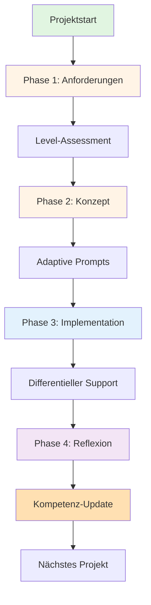

# Integration Guide: Didaktische Konzepte

## Überblick

Dieses Dokument beschreibt, wie die neuen didaktischen Frameworks in das bestehende `.copilot/` System integriert wurden.

---

## 🆕 Neue Komponenten

### 1. **[pedagogical-model.md](pedagogical-model.md)** ✨ NEU

**Inhalt:**
- **4-Phasen-Zyklus** (Anforderungsanalyse → Konzeptualisierung → Realisierung → Reflexion)
- **Rollenmodell** (Lernende, KI-Copilot "Kai", Lehrer)
- **Differentieller Code-Support** (adaptiv zu Anfänger/Fortgeschritten/Erfahren)
- **Didaktische Grundprinzipien** (Scaffolding, ZPD, Cognitive Apprenticeship)

**Nutzen:**
- Wissenschaftlich fundierte Basis für KI-gestütztes Lernen
- Klare Rollendefinitionen für alle Beteiligten
- Strukturierter Lernprozess mit messbaren Phasen

---

### 2. **[competency-framework.md](competency-framework.md)** ✨ NEU

**Inhalt:**
- **5 Kernkompetenzen:** Modellieren, Implementieren, Reflektieren, Kommunizieren, KI-Kooperation
- **4 Kompetenzlevel** pro Feld (Novize → Fortgeschritten → Kompetent → Expert)
- **Diagnostik-Methoden:**
  - Prompt-Evolution-Analyse
  - Code-Übernahmequote (Authorship-Tracking)
  - Debugging-Autonomie-Score
  - Konzept-Mastery-Tracker
  - Metakognitive Reifung
- **Bewertungs-Rubrik** für Lehrer
- **Self-Assessment** für Lernende

**Nutzen:**
- Messbare Indikatoren für Lernfortschritt
- Automatisierbare Diagnostik (Chat-Logs, Git-Analyse)
- Klare Bewertungskriterien für Projekte

---

## 🔗 Integration in Bestehendes Framework

### Bestehende Dateien (unverändert, aber nun komplementär)

#### [system-prompt.md](system-prompt.md)
**Aktualisiert mit:**
- Verweis auf `pedagogical-model.md` für didaktische Grundlagen
- Verweis auf `competency-framework.md` für Kompetenz-Tracking

**Verhältnis:**
- `system-prompt.md` = **Praktische Anweisungen** für Copilot (WIE)
- `pedagogical-model.md` = **Theoretische Basis** (WARUM)
- `competency-framework.md` = **Messbare Ziele** (WAS)

#### [phase-prompts.md](phase-prompts.md)
**Bleibt bestehen, nutzt jetzt:**
- 4-Phasen-Zyklus aus `pedagogical-model.md` als Struktur
- Kompetenzlevel aus `competency-framework.md` für adaptive Prompts

**Beispiel-Integration:**
```
Phase 2 (Konzeptualisierung) + Level "Anfänger":
→ Nutzt "Differentiellen Support" aus pedagogical-model.md
→ Prompt gibt detaillierte Modellierungshilfe
```

#### [conversation-patterns.md](conversation-patterns.md)
**Bleibt bestehen, erweitert um:**
- Koaktivitäts-Patterns aus `pedagogical-model.md`
- Assessment-Indikatoren aus `competency-framework.md`

**Neue Pattern-Typen:**
- **Requirement Elicitation** (Phase 1 aus Pädagogischem Modell)
- **Guided Modeling** (Phase 2)
- **Scaffolded Coding** (Phase 3 mit differenziellem Support)
- **Socratic Debugging** (Phase 4)

#### [project-spec-template.yaml](project-spec-template.yaml)
**Kann erweitert werden um:**
```yaml
pedagogy:
  current_phase: "implementation"  # aus pedagogical-model.md
  learner_level: "fortgeschritten"  # aus competency-framework.md
  scaffolding_level: "mittel"
  
competencies:
  modeling: 70  # % Mastery
  implementing: 60
  reflecting: 50
  communicating: 80
  ai_cooperation: 55
```

---

## 📊 Workflow-Integration

### Typischer Lernzyklus mit neuen Frameworks



### Copilot Decision Flow

```
1. Schüler stellt Frage/startet Aufgabe
   ↓
2. Copilot prüft: Welche Phase? (aus pedagogical-model.md)
   ↓
3. Copilot prüft: Welches Level? (aus competency-framework.md)
   ↓
4. Copilot wählt passende Strategie:
   - Anfänger in Phase 1 → Offene Fragen + Konkrete Beispiele
   - Fortgeschritten in Phase 3 → Strukturelle Hinweise
   - Erfahren in Phase 4 → Sokratischer Dialog
   ↓
5. Copilot gibt Response
   ↓
6. Copilot dokumentiert Interaktion für Progress-Tracking
```

---

## 🎯 Praktische Anwendung

### Für Copilot (KI)

**Beim Start einer Interaktion:**
1. Lies `project-spec.yaml` → erkenne Phase & Level
2. Referenziere `pedagogical-model.md` → wähle passende Rolle
3. Nutze `competency-framework.md` → passe Scaffolding an
4. Wende Prompts aus `phase-prompts.md` an

**Während der Interaktion:**
- Beobachte Indikatoren aus `competency-framework.md`
- Passe Unterstützung dynamisch an (Scaffolding & Fading)
- Dokumentiere Fortschritte im Chat

**Nach Projekt-Abschluss:**
- Aktualisiere Kompetenz-Scores in `project-spec.yaml`
- Dokumentiere Lessons Learned
- Empfehle nächste Schritte

---

### Für Lehrer

**Setup (einmalig):**
1. Lese `pedagogical-model.md` → verstehe Philosophie
2. Lese `competency-framework.md` → lerne Bewertungskriterien
3. Nutze Templates aus `project-spec-template.yaml`

**Pro Projekt:**
1. Initiales Assessment → Level einschätzen
2. Beobachten über Dashboard (Konzept in competency-framework.md)
3. Manuelles Review mit Rubrik (competency-framework.md)
4. Feedback geben, Level updaten

**Pro Semester:**
- Portfolio-Review aller Projekte
- Kompetenz-Progression analysieren
- Individuelle Förderpläne erstellen

---

### Für Lernende

**Monatlich:**
- Self-Assessment durchführen (competency-framework.md)
- Reflexionsjournal führen (pedagogical-model.md, Phase 4)
- Nächste Lernziele identifizieren

**Pro Projekt:**
- Spec erstellen mit `project-spec.yaml`
- Phasen durchlaufen (pedagogical-model.md)
- Dev-Log führen
- Präsentation vorbereiten

---

## 🔧 Technische Umsetzung

### Dateistruktur nach Integration

```
.copilot/
├── README.md                        # Hauptdoku (bestehend)
├── system-prompt.md                 # Copilot Instructions (aktualisiert)
├── pedagogical-model.md             # ✨ NEU: Didaktische Grundlagen
├── competency-framework.md          # ✨ NEU: Kompetenz-Tracking
├── integration-guide.md             # ✨ NEU: Diese Datei
├── phase-prompts.md                 # Detaillierte Prompts (bestehend, nutzt neue Frameworks)
├── conversation-patterns.md         # Patterns (bestehend, erweitert)
├── project-spec-template.yaml       # Template (kann erweitert werden)
├── example-project.md               # Beispiel (bestehend)
└── file-overview.md                 # Übersicht (zu aktualisieren)
```

### Empfohlene Updates

#### Minimal (sofort umsetzbar):
- ✅ `system-prompt.md` → Verweise auf neue Dateien (ERLEDIGT)
- ⏳ `README.md` → Abschnitt "Neue Frameworks"
- ⏳ `file-overview.md` → Neue Dateien dokumentieren

#### Optional (später):
- `phase-prompts.md` → Explizite Integration der 4 Phasen
- `conversation-patterns.md` → Neue Patterns aus pedagogical-model.md
- `project-spec-template.yaml` → Pedagogy + Competency Sections
- Tool-Integration: Dashboard-Prototyp (competency-framework.md)

---

## 📚 Quellenverankerung

Die neuen Frameworks basieren auf:

**Theoretische Fundierung:**
- Polya, G. (1945): Problem Solving
- Vygotsky, L. (1978): Zone of Proximal Development
- Collins, A. et al. (1989): Cognitive Apprenticeship
- Hubwieser, P. (2007): Didaktik der Informatik
- Wing, J. (2006): Computational Thinking
- GI-Bildungsstandards Informatik

**Praktische Konzepte aus Attachments:**
- Phasenmodell (Anforderungsanalyse → Konzept → Realisierung → Reflexion)
- Rollenmodell (Schüler, KI-Copilot "Kai", Lehrer)
- Kompetenzraster (5 Felder × 4 Level)
- Differentieller Code-Support
- Lernfortschrittsdiagnostik
- Koaktivitäts-Messung

---

## ✅ Status

**Erstellt:** 2025-11-03

**Integration:**
- ✅ `pedagogical-model.md` erstellt
- ✅ `competency-framework.md` erstellt
- ✅ `integration-guide.md` erstellt (diese Datei)
- ✅ `system-prompt.md` aktualisiert
- ⏳ `README.md` Update ausstehend
- ⏳ `file-overview.md` Update ausstehend

**Nächste Schritte:**
1. README.md aktualisieren
2. file-overview.md erweitern
3. Optionale Erweiterungen priorisieren
4. Testing mit echten Projekten

---

**Version:** 1.0  
**Datum:** 2025-11-03  
**Status:** Aktiv
